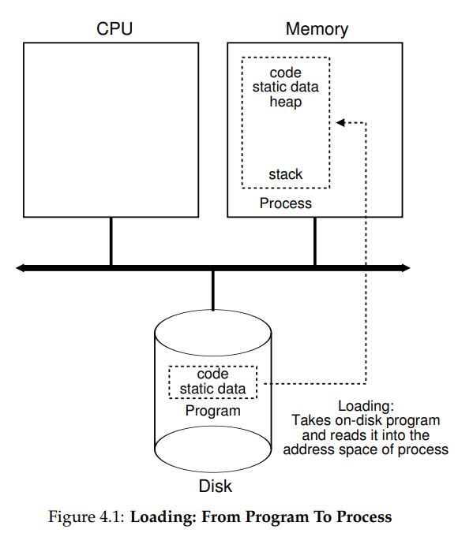
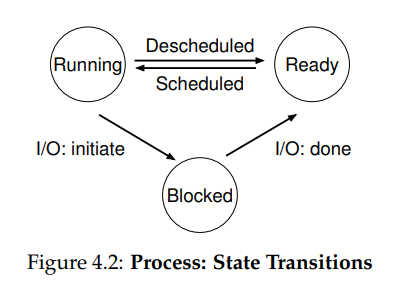

# Process abstraction

## Process

### Definition

a running program

- before running, program is mererly a data

### Virtuailization

- OS creates illusions of CPU by virtualizing it
	- by repeating running one process then stopping it and running another
	- can promote the illusion that many virtual CPUs exist
	- there is(are) only one or few physical CPU

#### Time sharing

the technique that is used to share limited resource(ex CPU) at multiple users or tasks(ex process)

- allow users to run concurrent processes

### Mechanisms

OS needs both low-level machinery and high-level intelligence to implement virtuailization

mechanisms:
- low-level methods or protocols that implement a needed piece of functionality
- how to `context switch` between processes

#### Policies

algorithms for making decision within the OS

- the form of intelligence that reside at the top of mechanisms
- decied which process to run

### Machine state

- what a program can read or update when it is running
- what parts are important to execution

## Constitution of process

- PID
- registers: PC, current operands, stack pointer, etc.
- file descriptors: pointers to open files and devices
	- used to transfer data about a command
	- stdin: input stream
	- stdout: output stream
	- stderr: error stream

### Memory image

programming pattern in which data stored on the database resides in memory

- process is comprised by memory
- instructions lie in memory
- address space, registers like PC, instruction pointer, stack pointer, frame pointer, etc.
- often access persistent storage devices like I/O information

#### Areas of memory

- static: 크기가 고정되어 있는 code, data
- dynamic: 크기가 가변적인 heap, stack
	- 힙 영역은 낮은 주소 -> 높은 주소
	- 스택 영역은 높은 주소 -> 낮은 주소
	- 할당되는 주소의 중복을 막기 위함

#### Code

- machine language commands that CPU will run
- read-only

#### Data

- datas that will be preserved while program runs
- ex: global variable

#### Heap

- user can allocate; in C, request such space by `malloc()` and free it explicitly by `free()`
	- 메모리 공간 반환: 해당 메모리 공간을 사용하지 않는다고 운영체제에 전달하는 것
	- 메모리 누수: 메모리 공간을 반환하지 않아 초래되는 메모리 낭비

#### Stack

- where data is temporarily saved
- ex: local variable, parameter

## Process API

the ideas that must be included in any interface or OS

1. create
2. destroy
3. wait
4. miscellaneous control
	- ex: suspend, resume
5. status

Miscellaneous: diverse, various

### Create

- OS must include method to create new processes
- ex: OS is invoked to create a new process to run the program indicated when we command into shell, double click application icon

shell:
- command-line interpreter that lets Linux and Unix users control their operating systems with command-line interfaces
- allow users to communicate efficiently and directly with their operating systems

## Process creation

### Load

- the first thing that OS must do to run a program is to load its code and static data into memory, into the address space of process
- programs initially reside on disk(or flash-based SSDs) in some kind of executable format
- in modern OS, loading process is done lazily

### Next sequence

1. (must) memory allocation for stack
	- some memory must be allocated for the program's run time stack
	- C programs use stack area to save variables, function parameters, and return addresses

2. initialization
	- initialize the stack with arguments
	- fill in the parameters to the `main()`; argc and argv array

3. memory allocation for heap
	- heap area is needed for linked lists, hash tables, trees, etc.
	- C programs use heap area to save explicitly requested dynamically-allocated data
	- C programs request such space by `malloc()` and free it explicitly by `free()`
	- OS may allocate more memory while running by requests via `malloc()`

4. other initialization
	- especially related to I/O; 
	- ex: in UNIX each process has three open file descriptors by defult
		- file descriptors: process-unique identifier for a file or other input/output resource
			- stdin, stdout, and stderr

5. last task
	- start the program running at the entry point; `main()`
	- by jumping to the `main()` routine, the OS transfers control of CPU to the newly-created process

#### How to create process

1. allocate memory and create memory image
	- load
	- create(allocate) runtime stack, heap
2. open baisc files
	- global constant pointers: STD IN, OUT, ERR
3. initializes CPU registers
	- PC points to first instruction in the code

## Process states

process can be in one of three states:

1. running
2. ready
3. blocked

#### Running

- process is running on a processor
- = executing instructions

#### Ready

- process is ready to run
- but for some reason, the OS has choesn not to run right now

#### Blocked

- process has performed some kind of operation(ex: I/O operation), that makes it not ready to run, until some other event(ex: I/O completion) takes place
- ex: when a process initiates an I/O request to a disk(thus other process can us the processor)
- disk issues an interrupt when data is ready

#### Others

- initial: process is in this state when it is being created
- final: process has exited but has not yet been cleaned up
	- called zombie state in UNIX based systems
	- allows other processes(usually parent) to examine the return code
- dead, terminated, completed: terminated
	- PCB is deleted

- when finished, parent make one final call `wait()` to wait for the completion of the child
- also indicate to the OS that it can clean up

#### Scheduled

- process being moved form ready to running
- <-> descheduled

#### Decisions

OS must make some decisions

- run other process while one process is issued an I/O
	- doing this improves resource utilization by keeping CPU busy
- switch or not switch into the process that is block by I/O operation immediatly when the I/O is completed
	- decision made by OS scheduler

## OS Data structures

- OS has some key data structures that track various relevant pieces of information 
- process list: contains information about all processes in the system
	- each entry is found in PCB
- PCB: Process Control Block, contains information about a specific process
	- PID, state, CPU scheduling information, CPU context of the process, pointers to parent / memory locations / open files 

### Register context

- will hold the contents of its registers for stopped process
- when process is stopped, save information of registers to memory and restore them to resume running
- context switch: this technique
	- 기존 프로세스의 문맥을 PCB(Process Control Block)에 백업하고 새로운 프로세스를 실행하기 위한 문맥을 PCB로부터 복구하여 새로운 프로세스를 실행하는 것