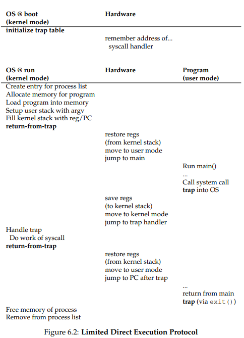
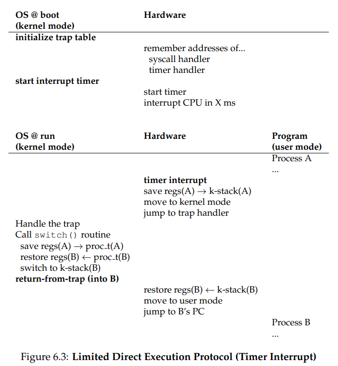

# Process execution mechanism: Limited direct execution(LDE)

basic technique to run program fast

- run program directly(natively) on the CPU

## Concepts

### Process execution

1. OS allocate memory and create memory img
	- code and data from exe
	- stack and heap memory
2. points CPU program counter to current instruction
	- other registers may store operand, return value, etc
3. OS is out of the way and process executes directly on CPU
	- LDE: run program directly on the CPU

### Function call

1. function call translates to a jump instruction
2. new stack frame pushed to stack and stack pointer updated
3. old value of PC, return value, pushed to stack and PC updated

- stack frame contains return value, function args, etc.
- this process is reversed at the end of the function call

### CPU resource

- time sharing(virtualization): repeat running one process for a while then running another
	- because OS need to share physical CPU among many jobs running at the same time

- challenges of building virtualization machinery
1. performance
	- implementing virtualization withdout adding excessive overhead(간접비용) to the system
2. control
	- running process efficiently while retaining(= keeping) control over CPU
	- OS often use hardware support to accomplish work effectively

### Program running sequence

the OS
1. create process entry for it(OS) in a process list
2. allocate memory
3. load program code into memory from disk
4. locate entry point
	- set up stack with argc/argv
	- clear registers
	- execute call `main()`
5. jumps to entry point
6. start running the code
	- program run `main()`

after running

7. program execute return from main
8. free memory of process is now availible
9. remove from the process list

### Phases

1. at boot time
	- kernel initialize the trap table
	- CPU remembers its location for subsequent use
	- kernel remebers its location via privileged instruction

2. when running a process
	- kernel sets up few things before using a return-from-trap instructions to start the execution of process
		- ex: allocating node on the process list, allocating memory
		- this switches CPU to user mode and begin running the process
	- when process wishes to issue a system call
		- traps back into the OS which handles issue
		- once again returns control via a return-from-trap to the process
	- process complete its work and returns from `main()`
		- usually return into some stub code which will properly exit the program
		- OS cleans up

## Problem #1: Restricted operations

when process want to perform restricted opertation

### Example

- issuing I/O request to a disk
- gaining access to more system resources such as CPU or memory

#### Expected result

- prevent contstruction of desirable systems
- ex: checking permmisions before accessing to a file is usless if any user process can issue to I/O to disk
	- reading or writing entire disk is able without permission

### Solution: Dual mode

#### User mode

the mode in which the OS service cannot be provided

- running codes are restricted
- cannot run codes of kernel area
- cannot execute operations that access to the hardware resources
- trying access to hardware resources will cause an exception; process will be killed

#### Kernel mode

the mode that the OS service can be provided

- privileged, non-restricted
- can run codes of kernel area
- can access to the hardware resources

#### Kernel

kernel does not trust user stack, user provided addresses
- use separate kernel stack
- set Interrupt Descriptor Table(IDT) at boot time
	- IDT has addresses of kernel functions to run for system calls and other events

### System call

system call is used by the process in user mode to raise privilege level to kernel mode

- when system call occus, trap into the kernel to request operating system services
- kind of a software interrupt
- system calls allow kernel to expose certain key pieces of funcitonality to user program like
	- accessing file system
	- create/destroy process
	- communicate with other process
	- allocate more memory

#### Execution of system call

1. execute trap instruction that simultaneously jumps into kernel and raises privilege level to kernel mode
2. in the kernel, system can perform privileged operations; do required work for calling process
3. when finished, OS calls return-from-trap instruction
	- return into the calling user program while reducing privilege level back to user mode

#### 번외: Why system calls look like procedure calls

system call like `open()` or `read()`

- they are procedure calls
- procedure call is hidden inside; procedure call is trap instruction

1. call system call(with procedure call inside)
2. procedure call is executed into the C library; using agreed-upon calling convention with kernel
	- put arguments to the system call in locations like stack or registers
	- put system-call number into a locations like stack or registers
	- execute aforementioned trap instuction, procedure call
3. code in the library after the trap unpacks return values and returns control to the program that issued system call

### Trap

an interrupt generated by CPU

#### Executed case

- process in user mode attempts to execute a privileged instruction(= system call)
- encounter an error; program fault
- interrupt; external device needs attention of OS

#### Mechanism

- CPU move to higher privilege level; transfers control to kernel
- CPU execute a trap handler
- look up address in IDT and jump to trap handler function
- switch to kernel stack and save context on it

#### Return

when OS is done handling system call or intterup, it calls `return-from-trap` instruction

1. restore context of CPU registers from kernel stack
2. reduces privilege
3. returns control(restore PC) and jump to the instruction(user code) after the trap that jumped into the OS

#### Trap handler

the code that will run when the trap is triggered

- handles system call inside
- checks the type of trap and take action
- when exceptional event occurs, OS informs hardware locations of trap handlers
	- trap handlers tell hardware what code to run; by system call
	- once hardware is informed, it remebers location of handlers until the machine is next rebooted
	- preivileged operation; cannot execute in user mode

#### Trap table

- kernel set up a trap table at boot time
	- when machine boots up, privileged kernel mode boots up
	- thus is free to configure machine hardware as need be(필요한 만큼)

### Method that trap distinguish codes to run

calling process can't specify an address to jump

- because user code cannot specify an exact address to jump to

#### System-call number

system-call number is assigned to each system call to specify the exact system call

- user code is responsible for placing desired system-call number in a register or at specified location on the stack
- OS(handling system call inside trap handler):
1. examine system-call number
2. ensures it is valid
3. if it is valid, executes the corresponding code
	- this level of indirection serves as a form of protection

#### 번외: Inputs in secure system

- handling arguments at the system call boundary
	- have to check if user apsses in and ensure that arguments are properly specified or otherwise reject call
	- ex: user passing the address inside the kernel portion; user can read kernel memory
		- this can lead to reading other memory of any other process in the system

example
1. when a hardware intterupt occurs, OS informs the hardware of the locations of trap hadlers
	- trap handler: some kind of special instruction
2. once hardware is informed, it remembers location of handlers until the machine is next rebooted
	- thus hardware know what code to jump to when system calls and other exceptional event occurs

## Problem2: 
problem with direct execution achieves a switch between processes

- if process is running on the CPU this by definition means OS is not running
	- my guess: OS is a process and CPU can run one process at a time

then how can OS regain control of the CPU so that it can switch between processes?

### Cooperative approach: wait for system calls

approach that some systems have taken in the past

#### Concept

OS trusts the processes of the system to behave reasonably

- processes that run too long are assumed to periodically(주기적으로) give up the CPU
- so OS can decide to run some other task

#### Principle

1. Processes transfer control of CPU to the OS frequently by making system calls
	- systems like this often include an explicit yield system call
		- does nothing except to transfer control to the OS
		- so OS can run other processes

2. Applications also transfer control to the OS when they do something illegal
	- illegal movement generate a trap to the OS
	- OS have control of CPU again and likely terminate the offending process

#### Conclusion

thus in cooperative scheduling system, OS regains control of the CPU
- by waiting for a system call or an illegal operation to take place

#### Problem

if process ends up in an infinite loop and never makes a system call

- OS never regains control of CPU
- only recourse: reboot the machine

### Non-cooperative approach: the OS takes control

use timer interrupt that raise an interrupt every so many millisecond

- when interrupt is raised, currently running process is halted and a pre-configured interrupt handler in the OS runs
	- OS has regained control of the CPU
	- can stop current process and start different one

#### Hardware

- OS must inform the hardware of which code to run when the timer interrupt occurs
	- at boot time, OS does
	- during the boot sequence, OS must start the timer
		- starting a timer is privileged operation

- when an interrupt occurs, hardware has responsibility to
	- save enough of the state of the program that was running when the interrupt occurred
		- like registers
	- subsequent return-from-trap instruction will be able to resume the running progarm corecctly

## Context

하나의 프로세스 수행을 재개하기 위해 기억해야 하는 정보

- when OS regain control, it need to decide
	- whether to continue running the currently-running process or switch to a different one
	- it is made by a scheduler

### Scheduler

constructed by two parts

1. policy to pick which process to run(on next lecture)
2. mechanism to switch to that process

#### Two kinds of schduler

- cooperative, non-preemptive scheduler: polite
	- switch only if process blocked or terminated
- non-cooperative, preemptive sheduler: switch even when process is ready to continue
	- CPU generate periodic timer interrupt
	- OS checks if the current process has run for too long

### Context switch

the piece of low-level code that OS execute when it decided to switch to a different process

#### Sequence

1. save context of currently-executing process to its kernel stack
	- OS execute low-level assembly code to save general purpose registers, PC, kernel stack pointer
2. restore context of soon-to-be-executing process from its kernel stack
	- OS restore general purpose registers, PC, kernel stack pointer, PC
3. switch stack pointer to kernel stack of B
	- kernel enters call to switch code in the context of process that was interrupted
	- kernel returns in the context of soon-to-be-executing process
4. OS execute a return-from-trap instruction
	- soon-to-be-executing process become current process

강의랑 교재랑 순서가 좀 다른데,
교재에서는 restore context of next process -> switch stack pointer to next process이고
강의에서는 switch stack pointer to next process -> restore context of next process
노트정리는 교재 기준으로 했음

#### Types of context(register) save/restore

1. when timer interrupt occurs(ex. system call)
	- user context of the running process are implicitly saved
	- by the hardware 
	- to its kernel stack
	- restored by return-from-trap
2. when OS decide to switch from current to next process
	- kernel registers are explicitly saved
	- by the software(= OS)
	- to memory in the process structure, kernel stack of the process
	- this action moves the system from running
		- as if the system just trapped into the kernel from current process to the kernel from next process
		- restores kernel context of next process

## 번외: Concurrency

- problem: interrupt occurs when during the other interrupt or trap handling
- solution: disable interrupt during interrupt processing, locking, etc.
- concurrency에서 나올 내용
