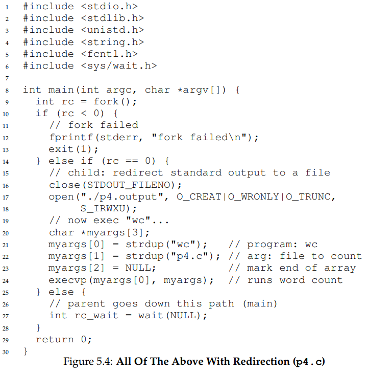

# Process API

unix에서 이용되는 API들

## `fork()` system call

used to create a new process

- create child process from the parent process
- copy the calling process child from parent
	- `fork()` 시도한 그 위치부터 fork된 프로세스가 동작함; `main()`부터 시작하지 않음
- 값 동일: PC, CPU register, open files
- 별개: address space, `fork()`의 반환값
- without taking parameter, returns an integer value
	- negative: creation was unsuccessful
	- zero: returned to the newly created chiled process
	- positive: returned to parent or caller, value equals to the PID of newly created child process

### Example

```
#include <stdio.h>
#include <unistd.h>

int main()
{
	printf("parent pid: %d\n", getpid());
	int returnValue = fork();
	if (returnValue < 0){
		printf("fork failed: %d\n", returnValue);
	} else if(returnValue == 0) {
		printf("I'm child process, pid: %d\n", getpid());
	} else {
		printf("I'm parent process(pid: %d), child process pid: %d\n", getpid() ,returnValue);
	}
	return 0;
}
```

#### Output Expectation

assume that returnValue is 0

```
1. parent pid: (parent pid)
2. I'm parent process(pid: parent pid), child process pid: (child pid)
3. I'm child process, pid: (child pid)
```

or

```
1. parent pid: (parent pid)
2. I'm child process, pid: (child pid)
3. I'm parent process(pid: parent pid), child process pid: (child pid)
```

- child process starts running from `int returnValue = fork();`

### Running sequence

When forking a parent process, there are now two processes running -> result is not determinism becase

- scheduler determines which process to run
- cannot make string assumptions as shcelduler is complex

## `wait()` system call

make process wait

- parent process delay its execution until the child finisheds executing when `wait()` is called
- when child is done, `wait()` returns to the parent
- makes output deterministic: set the seqeunce explicitly
- return the pid of child process 

### Example

```
#include <stdio.h>
#include <unistd.h>
#include <sys/wait.h>

int main()
{
	printf("parent pid: %d\n", getpid());
	int returnValue = fork();
	if (returnValue < 0){
		printf("fork failed: %d\n", returnValue);
	} else if(returnValue == 0) {
		printf("I'm child process, pid: %d\n", getpid());
	} else {
		int returnOfWait = wait(NULL);
		printf("I'm parent process(pid: %d, return of wait: %d), child process pid: %d\n", getpid(), returnOfWait, returnValue);
	}
	return 0;
}
```

#### Output expactation

```
1. parent pid: (parent pid)
2. I'm child process, pid: (child pid)
3. I'm parent process(pid: parent pid, return of wait: child pid), child process pid: (child pid)
```

## `exec()` system call

used when running a dfferent program from the calling program

1. given name of an executable and arguments 
2. loads code and static data from that executable and overwrite its current code segment and current static data
3. heap and stack and other parts of memory space of the program are re-initialized
4. OS runs that program, passing in any arguments as the `argv` of that process

- does not create new process
	- transforms the currently running program into a different running program
- successful call to `exec()` never returns


### Example

program: origin.c

```
#include <stdio.h>
#include <unistd.h>
#include <sys/wait.h>
#include <stdlib.h>
#include <string.h>

int main()
{
	printf("parent pid: %d\n", getpid());
	int returnValue = fork();
	if (returnValue < 0){
		printf("fork failed: %d\n", returnValue);
	} else if(returnValue == 0) {
		printf("I'm child process, pid: %d\n", getpid());
		myargs[0] = strdup("newprogram"); // program "newprogram"
		myargs[1] = strdup("origin.c"); // arg: input file
		myargs[2] = NULL; // marking the end of the array
		execvp(myargs[0], myargs); // run "newprogram"
		printf("this will not be printed thus successful exec() not returns");
	} else {
		int returnOfWait = wait(NULL);
		printf("I'm parent process(pid: %d, return of wait: %d), child process pid: %d\n", getpid(), returnOfWait, returnValue);
	}
	return 0;
}
```

- `strdup(String)`: returns a pointer to a null-terminated byte string
	- duplicate of the string pointed to by `String`

program: newprogram

```
int main()
{
	printf("exec() worked successfully!\n");
	return 0;
}
```

#### Output expactation

```
1. parent pid: (parent pid)
2. I'm child process, pid: (child pid)
3. exec() worked successfully!
4. I'm parent process(pid: parent pid, return of wait: child pid), child process pid: (child pid)
```

## Motivating API

`Shell`: user program

- in UNIX shell, it runs code after the call to `fork()`, before the call to `exec()`
	- can alter the environment of the about-to-be-run program
	- ex: input/output redirection, pipies, etc.

### Process of shell

1. shows a prompt and waits for input
2. when input(like command) occurs, figures out the destination in the file system of the executable
3. calls `fork()` to create a new child process
4. calls `exec()`s to run the command
5. waits for the command to complete by calling `wait()`
6. when child completes, returns from `wait()` and return to 1

### Example

`prompt > newprogram origin.c > newfile.txt`

- output of program `newprogram` is redirected into the output file `newfile.txt`
- `>` says redirection is indicated

#### Expected output

1. when child is created the shell(code executed in the child process) closes standard ouput and opens the file `newfile.text`
2. ouput from soon-to-be-running program `newprogram` is sent to the file instead of the screen

- after this process, call `exec()`
- open file descriptors are kept open across the `exec()` call, enabling this behavior

#### More example



```
prompt> ./p4
prompt> cat p4.output
	32	109	846 p4.c
prompt>
```

- looks like it's ready for next commad immediately but `p4` called `fork()` and run the `wc` program via a call to `execvp()`
- output is not printed becuase it has been redirected to the file `p4.output`
- `cat`: standard UNIX utility that read files sequentially, writing them to standard output
	- name is derived from `catenate files`, its function
	- single argument: print a file to user's terminal emulator
	- mutiple arguments: concatenates files

### File descriptors

unsigned integer used by a process to identify an open file

- UNIX system start looking for free file descriptors at zero
	- in the example above, `STDOUT FILENO` will be the first availible file descriptor
		- get assigned when `open()` is called
- subsequents writes by the child process to the standard output file desciptor
	- will then be routed transparently to the newly-opened file instead of the screan


### `pipe()` system call

implemented in a similar way to the example above

- output of one process is connected to an kernel pipe(queue), input of another process is connected to that same pipe
- output of one process seamlessly is used as input to the next
- chains of commands can be strung together

## Process control and users

- man pages: manual page of the UNIX system
- process control is available in the form of signals

### Ways to control process

- `kill()`: used to send signals to a process
	- directives to pause, die, and other useful imperatives
- in UNIX shells, certain keystroke combinations are configured to deliver a specific signal to the currently running process
	- `ctrl + c`: send `SIGINT` interrupt to process and normally terminate it
	- `ctrl + z`: send `SIGTSTP` signal to pause process in mid-execution
- `signal()` system call: catch various signals

### User

- users generally can only control their own processes
- OS parcel out resources like CPU, memory, disk to each user and their processes to meet overall system goals

## Tools and Summary

### Tools

- `ps`: can see which processes are running
- `top`: displays the processes of the system and how much CPU and other resources they are eating up

#### Root, the superuser

- system generally needs a user who can administer the system
- superuser is not limited in the way most users are
- can kill abitrary process(abitrary: 임의의)