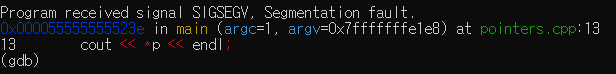
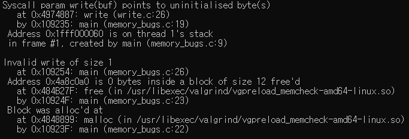
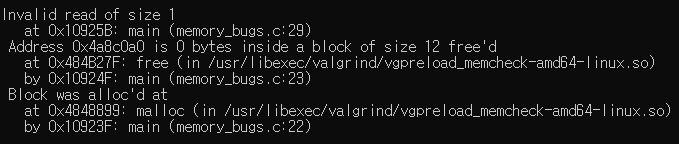
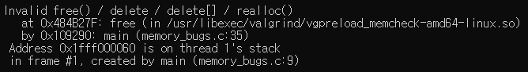
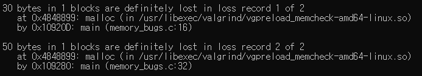

# Exercise

## Part A

### 1

#### Given

debug `pointers.cpp` using GDB

- program: contains pointer related operations
- bug: generates a segmentation fault
- task: find the line number of the wrong statement

#### Answer

1. `run`


so the line number of wrong statement is 13

### 2

#### Given

debug `fibonacci.cpp`

- program: print fibonacci numbers until certain value of `n`
- bug: logical error to print wrong output
- task: debug
	- insert suitable breakpoints
	- pause program execution
	- print intermediate values of variable from GDB
	- monitor execution step by step in order to find logical error
	- demonstrate process of debugging using GDB

#### Answer: process

1. set breakpoint with `break`
2. `step` to run one line of code at a time]
3. found that value of `second_last` is `1`, not `0`
4. `step`
5. found that value of `second_last` became equal to `last` becuase of 
```
last = next;
second_last = last;
```

#### Answer: conclusion

1. change `int second_last = 1;` of line 8 to `int second_last = 0;`
2. change 
```
last = next;
second_last = last;
```
of line 16~17 to
```
second_last = last;
last = next;
```

debugged file saved as `fibonacci-debug.cpp`

## Part B

- program: riddled with memory bugs
- task: find possible issues present in the program using valgrind
	- understand different issues valgrind can detect
	- use command to find issues present in the program
	- might provide possible reasons and fixes for some issues during evalution

### Answer

runned valgrind with commad ` valgrind --tool=memcheck --leak-check=yes --show-reachable=yes --num-callers=20 path/executable_name`

1. line 26: pointing to uninitialised byte, invalid write size


2. line 29: invalid read size


3. line 35: invalid free()


4. line 16: memory lost - 30 byte
5. line 32: memory lost - 50 byte


#### Fix

1. line 26
	- change line 22 into `p = (char *)malloc(1);`

2. line 29
	- 상동

3. line 35
	- delete; memory is not allocated by `malloc()` to `arr`

4. line 16
	- delete; not used memory

5. line 32
	- delete; not used memory