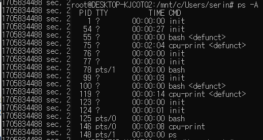

# Exercise

## 1. Understand hardware configuration using the `/proc` filesystem

#### a

- processor: CPU
- cores: smallest independent unit that implements a general purpose processor
	- run the command
	- 전통적으로는 한 CPU 내부에 하나만 존재했으나 여러 개로 늘어남
	- hyperthreading: intel's technique of multithread

#### b

6

#### c

1

#### d

2.90GHz

#### e

x86_64

#### f

13014708

#### g

12889932

#### h

291 forks / can find in `/proc/stat` but permission denied

## 2. Understand how to monitor status of running process using `top`

#### a

1275

#### b

100%

#### c

running

## 3. Understand how the shell runs user commands by spawning new child processes to execute the various commands

#### a

- TTY: terminal type that user is logged into
- TIME: amount of CPU in minutes and secods that process has been running
- CMD: name of the command that launched the process

#### b

#### c

file descriptor of standard output is pointing at `/tmp/tmp.txt` to perform output redirection

#### d

- standard input is pointing at pipe
- input result of `cpu-print` to `grep`

- Linux systems allow the stdout of a command to be connected to the stdin of another command
- `|`: pipe character, used to combine two or more commands
	- ouput of one command act an input to another command
	- unidirectional; flows form left to right

#### e

- internal command = executed by bash shell: cd, history
- external command = implemented by bash code: ls, ps

## 4

## 5

while running disk.c

while running disk1.c

- tps: transfer(I/O request to the device)/s

## 6

`strace (dummy)`

- [write system call at linux](https://man7.org/linux/man-pages/man2/write.2.html)