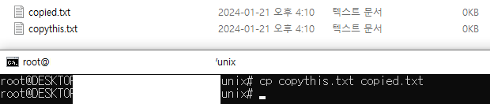
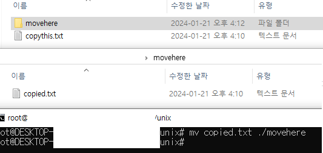
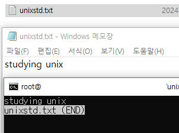
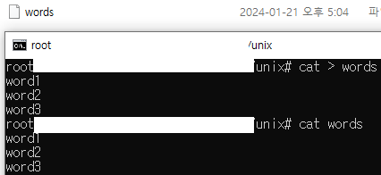
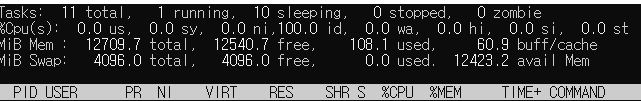

# Preparation 1: Basic linux commands

[Reference](http://linuxclass.heinz.cmu.edu/doc/Unix-Tutorial-surrey/)

## UNIX

kind of operating system

- X window provide GUI between user and UNIX
- made up of three parts; kernel, shell, program

### Kernel

hub of OS

- allocate time and memory to program
- handle filestore and communications in response to system call
- shell request to kernel through system call

### Shell

Command Line Interpreter

- acts as an interface between user and kernel
- started when user log in and login program check username, password and run program called shell

- interpret command that user types in
- arrange the command to be carried out
	- carry out: 수행하다
- gives prompt(%) when commands terminate
	- commands are themselves programs

### File and processes

everything in UNIX is file or process

- process: executing program identified by PID
- file: collection of data
	- created by user using text editors, running compilers, etc.

### Directory structure

all files are grouped in the directory structure

- arranged in hierarchical structure
- root: top of hierarchy

## Directory

### Listing files and directories

- when you first login, current working directory is home directory
	- home directory has same name as user name
- `ls`: lists the contents of current working directory
	- if there are no files visible, UNIX prompt will be returned
	- does not list hidden files: files starting with `.`
- `ls -a`: list the contents including hidden files of current working directory

### Making directory

- `mkdir (subdirectory name)`

### Changing to different directory

- `cd (directory name)`
- windows prompt에서와 다르게 디렉토리는 `\`이 아니라 `/`으로 구분해야 함

### Parent and current directory

- `.`: current directory
- `..`: parent directory
- use `cd` to move

### Pathname

- enable to work out location of current working directory relation to the whole file system
	- 전체 파일 시스템에 대해 현재 위치 파악 가능
- `pwd`: find absolute pathname

## Basic commands

### Copy

- `cp (to_be_copied_file) (copied_file_name)`: copy file of current working directory and name it

### Move

- `mv (to_be_moved_file) (departure)`

### Remove

- `rm (to_be_removed_file)`
- `rmdir (to_be_removed_diretory)`

### Display

- `clear`: clear screan of the terminal window

#### `cat`

1. display
	- `cat (file)`: display content of file on the screen
2. concatenate
	- `cat (file1) (file2) ... > (target_file)`: join file1, file2, ... , to target_file
		- target file can be the one that will be concatenated

#### `less`

`less (file)`: write the content of a file onto the screen a page at a time

- press [q] to escape

#### `head` and `tail`

- `head -(number) (file)`: write the first (number) lines of a file
	- number is 10 by default
- `tail -(number) (file)`: write the last (number) lines of a file
	- number is 10 by default

### Search

#### In `less`

- while in `less`, `/(searching_word)`
	- the word will be highlighted
	- example: `/st`

#### `grep`

`grep (finding_word) (file)`: search files for specified words or patterns

- sensitive: distinguish lower case and capital
- to find phrase or pattern(with blank inside), enclose it with single quotes

- options
1. -i: became less sensitive
2. -v: display those lines that do NOT match
3. -n: precede each maching line with the line number
4. -c: print only the total count of matched lines
5. -ivc: number of lines that do not match

#### `wc`

- `wc (file)`: count line, word, character, and file name in default
	- `-w`: word count
	- `-l`: line count

## Redirection

### Redirect output

use `>` to redirect output of a command

#### Using `cat`

`cat > (file)`: create a file

- type in texts and press [enter] after each line
- press [ctrl] + [d] to stop

### Redirect input

use `<` to redirect input of a command

#### Using `sort`

- `sort`: sort the texts that will be typed in
	- press [ctrl] + [d] to stop
- `sort < (file)`: sort content of file

### Pipes

#### `who`

see who is on the system

- `who > (file)`: make a list of names in the system
- `who | wc -l`: find how many users are logged on

## Common tools

### `top`

display continuously updating screen of processes

- sorted by CPU usage in descending order

#### Attributes

- PR: priority
- NI: nice value of task
	- 음수: imply higher priority
- VIRT: total virtual memory used by the task
- RES: physical RAM usage(kb)
- SHR: shared memory size(kb) used by the task
- %CPU: CPU usage
- %MEM: memory usage
- TIME+ CPU time
- COMMAND: name of command that started the process

### `ps`

show Status of Processes

- by default, shows processes that are connected to currently using window or screen

#### Options

- `-a`: list all processes for all users
- `-A`, `-e`: list all processes on the entire system
	- complete overview of running tasks and programs